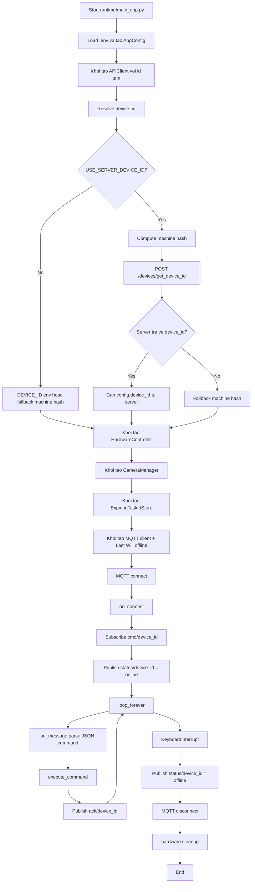
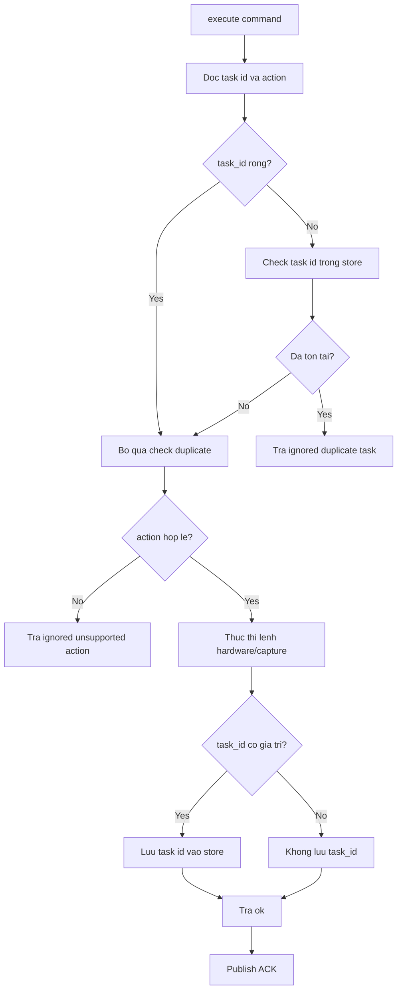
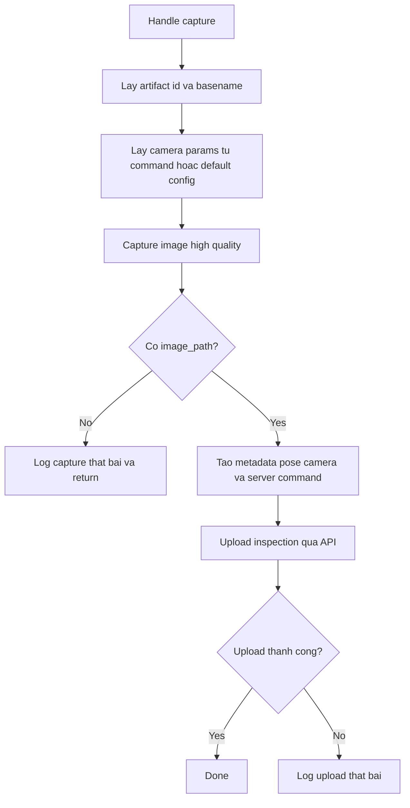
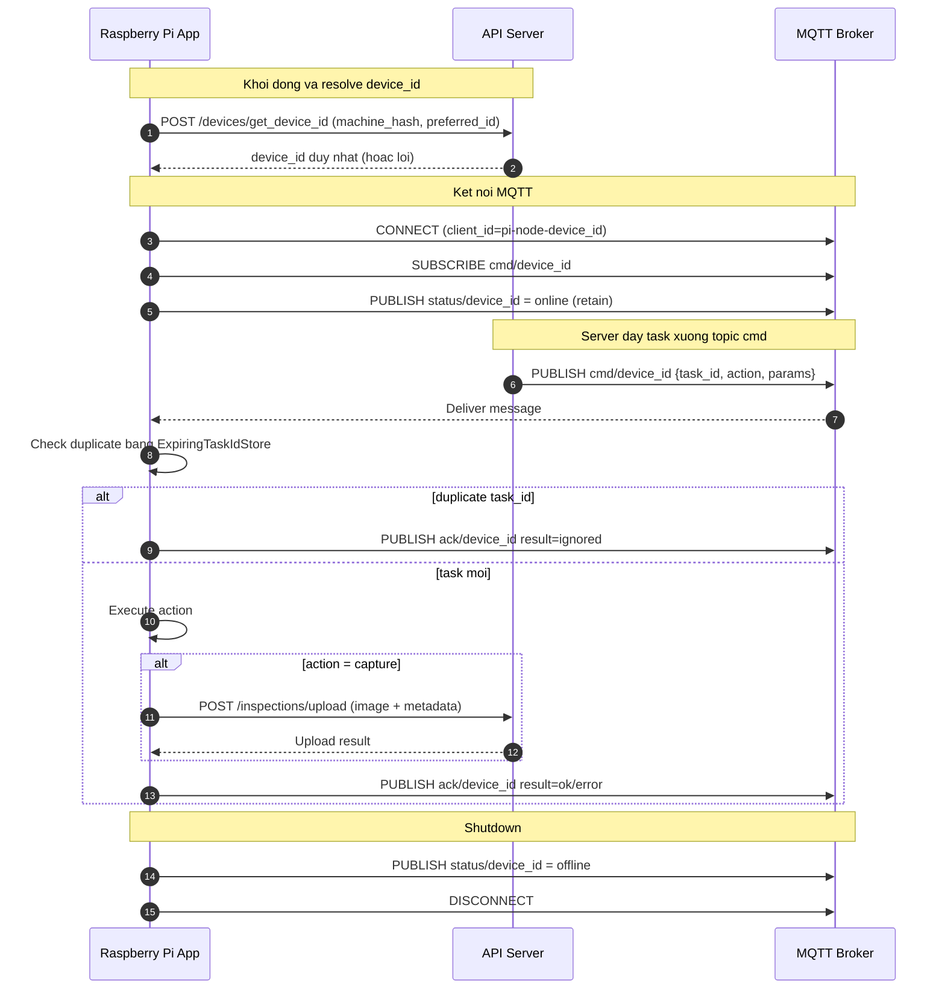

# IoT App Flow

## Tong quan luong hoat dong

```mermaid
flowchart TD
    A[Start runtime/main_app.py] --> B[Load .env va tao AppConfig]
    B --> C[Khoi tao APIClient voi id tam]
    C --> D[Resolve device_id]
    D --> D1{USE_SERVER_DEVICE_ID?}
    D1 -- No --> D2[DEVICE_ID env hoac fallback machine hash]
    D1 -- Yes --> D3[Compute machine hash]
    D3 --> D4[POST /devices/get_device_id]
    D4 --> D5{Server tra ve device_id?}
    D5 -- Yes --> D6[Gan config.device_id tu server]
    D5 -- No --> D7[Fallback machine hash]
    D2 --> E[Khoi tao HardwareController]
    D6 --> E
    D7 --> E
    E --> F[Khoi tao CameraManager]
    F --> G[Khoi tao ExpiringTaskIdStore]
    G --> H[Khoi tao MQTT client + Last Will offline]
    H --> I[MQTT connect]
    I --> J[on_connect]
    J --> K[Subscribe cmd/device_id]
    K --> L[Publish status/device_id = online]
    L --> M[loop_forever]

    M --> N[on_message parse JSON command]
    N --> O[execute_command]
    O --> P[Publish ack/device_id]
    P --> M

    M --> Q[KeyboardInterrupt]
    Q --> R[Publish status/device_id = offline]
    R --> S[MQTT disconnect]
    S --> T[hardware.cleanup]
    T --> U[End]
```

## Luong idempotency task_id (TTL + max entries)

```mermaid
flowchart TD
    A[execute command] --> B[Doc task id va action]
    B --> C{task_id rong?}
    C -- Yes --> D[Bo qua check duplicate]
    C -- No --> E[Check task id trong store]
    E --> F{Da ton tai?}
    F -- Yes --> G[Tra ignored duplicate task]
    F -- No --> D

    D --> H{action hop le?}
    H -- No --> I[Tra ignored unsupported action]
    H -- Yes --> J[Thuc thi lenh hardware/capture]
    J --> K{task_id co gia tri?}
    K -- Yes --> L[Luu task id vao store]
    K -- No --> M[Khong luu task_id]
    L --> N[Tra ok]
    M --> N

    N --> O[Publish ACK]
```

## Luong capture va upload

```mermaid
flowchart TD
    A[Handle capture] --> B[Lay artifact id va basename]
    B --> C[Lay camera params tu command hoac default config]
    C --> D[Capture image high quality]
    D --> E{Co image_path?}
    E -- No --> F[Log capture that bai va return]
    E -- Yes --> G[Tao metadata pose camera va server command]
    G --> H[Upload inspection qua API]
    H --> I{Upload thanh cong?}
    I -- Yes --> J[Done]
    I -- No --> K[Log upload that bai]
```

## Sequence giao tiep Server - Raspberry Pi

```mermaid
sequenceDiagram
    autonumber
    participant R as Raspberry Pi App
    participant S as API Server
    participant B as MQTT Broker

    Note over R,S: Khoi dong va resolve device_id
    R->>S: POST /devices/get_device_id (machine_hash, preferred_id)
    S-->>R: device_id duy nhat (hoac loi)

    Note over R,B: Ket noi MQTT
    R->>B: CONNECT (client_id=pi-node-device_id)
    R->>B: SUBSCRIBE cmd/device_id
    R->>B: PUBLISH status/device_id = online (retain)

    Note over S,B: Server day task xuong topic cmd
    S->>B: PUBLISH cmd/device_id {task_id, action, params}
    B-->>R: Deliver message

    R->>R: Check duplicate bang ExpiringTaskIdStore
    alt duplicate task_id
        R->>B: PUBLISH ack/device_id result=ignored
    else task moi
        R->>R: Execute action
        alt action = capture
            R->>S: POST /inspections/upload (image + metadata)
            S-->>R: Upload result
        end
        R->>B: PUBLISH ack/device_id result=ok/error
    end

    Note over R,B: Shutdown
    R->>B: PUBLISH status/device_id = offline
    R->>B: DISCONNECT
```
