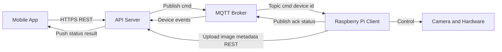
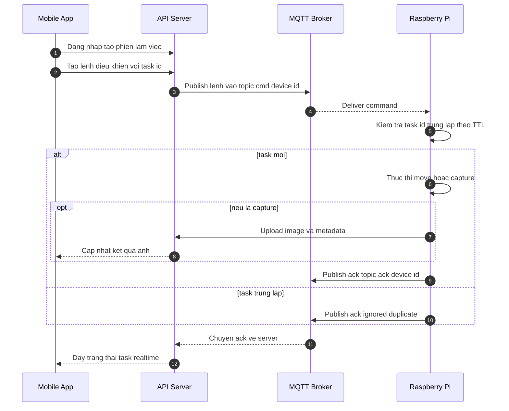

# IoT Communication Flow

## Kien truc tong quan

```mermaid
flowchart LR
    M[Mobile App]
    S[API Server]
    B[MQTT Broker]
    R[Raspberry Pi Client]
    C[Camera and Hardware]

    M -->|HTTPS REST| S
    S -->|Publish cmd| B
    B -->|Topic cmd device id| R
    R -->|Control| C
    R -->|Publish ack status| B
    B -->|Device events| S
    R -->|Upload image metadata REST| S
    S -->|Push status result| M
```

## Sequence giao tiep Mobile Server Raspberry Pi

```mermaid
sequenceDiagram
    autonumber
    participant M as Mobile App
    participant S as API Server
    participant B as MQTT Broker
    participant R as Raspberry Pi

    M->>S: Dang nhap tao phien lam viec
    M->>S: Tao lenh dieu khien voi task id
    S->>B: Publish lenh vao topic cmd device id
    B-->>R: Deliver command

    R->>R: Kiem tra task id trung lap theo TTL
    alt task moi
        R->>R: Thuc thi move hoac capture
        opt neu la capture
            R->>S: Upload image va metadata
            S-->>M: Cap nhat ket qua anh
        end
        R->>B: Publish ack topic ack device id
    else task trung lap
        R->>B: Publish ack ignored duplicate
    end

    B-->>S: Chuyen ack ve server
    S-->>M: Day trang thai task realtime
```
